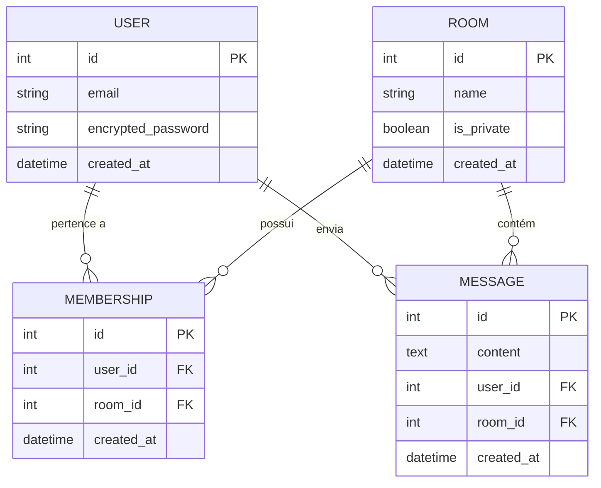

# Configuração Completa do Banco de Dados - NexusChat

Este guia documenta todo o processo de configuração do PostgreSQL via Docker, criação das tabelas e conexão com ferramentas externas.

---

## 📋 Visão Geral

- **Banco:** PostgreSQL 13
- **Ambiente:** Docker
- **Porta:** 5433 (para não conflitar com PostgreSQL local)
- **Tabelas:** 4 principais (users, rooms, memberships, messages)

---

## 🐳 1. Configuração do Docker

### Por que Docker?

O PostgreSQL está rodando **dentro de um container Docker** isolado do seu sistema. Isso traz várias vantagens:

✅ **Isolamento:** Não interfere com outros PostgreSQL instalados  
✅ **Portabilidade:** Funciona igual em qualquer máquina  
✅ **Facilidade:** Um comando sobe tudo  
✅ **Limpeza:** Pode deletar tudo sem deixar rastros

### Onde o Banco Está?

```
┌─────────────────────────────────────────────┐
│         SEU COMPUTADOR (localhost)          │
│                                             │
│  ┌───────────────────────────────────┐     │
│  │   DOCKER (Container)              │     │
│  │                                   │     │
│  │   📦 PostgreSQL rodando aqui      │     │
│  │   Porta INTERNA: 5432             │     │
│  └───────────────────────────────────┘     │
│              ⬆️  ⬇️                          │
│         Porta 5433                          │
│                                             │
│  🖥️ Rails (rodando FORA do Docker)         │
│  🖥️ pgAdmin (rodando FORA do Docker)       │
└─────────────────────────────────────────────┘
```

**Dados salvos em:** `/backend/pgdata/` (volume Docker)

### Configuração do docker-compose.yml

```yaml
services:
  db:
    image: postgres:13
    container_name: nexuschat-db
    environment:
      POSTGRES_USER: postgres
      POSTGRES_PASSWORD: postgres
      POSTGRES_DB: backend_development
    volumes:
      - ./pgdata:/var/lib/postgresql/data
    ports:
      - "5433:5432"  # 👈 Porta externa 5433 (evita conflito)

  backend:
    build: .
    container_name: nexuschat-rails_backend
    command: tail -f /dev/null
    volumes:
      - .:/app
    ports:
      - "3000:3000"
    depends_on:
      - db
    environment:
      RAILS_ENV: development
      DATABASE_URL: postgres://postgres:postgres@db:5432/backend_development
```

### Comandos Docker

```bash
# Subir os containers
docker compose up -d

# Verificar se está rodando
docker ps | grep nexuschat

# Ver logs do PostgreSQL
docker logs nexuschat-db

# Ver logs em tempo real
docker logs -f nexuschat-db

# Parar os containers
docker compose down

# Parar e DELETAR todos os dados (CUIDADO!)
docker compose down -v
```

---

## ⚙️ 2. Configuração do Rails

### Arquivo: config/database.yml

```yaml
default: &default
  adapter: postgresql
  encoding: unicode
  # 👇 Para desenvolvimento local (fora do Docker)
  host: localhost
  port: 5433
  username: postgres
  password: postgres
  pool: <%= ENV.fetch("RAILS_MAX_THREADS") { 5 } %>

development:
  <<: *default
  database: backend_development

test:
  <<: *default
  database: app_test

production:
  <<: *default
  database: app_production
  username: app
  password: <%= ENV["APP_DATABASE_PASSWORD"] %>
```

**Importante:** 
- `host: localhost` porque Rails roda FORA do Docker
- `port: 5433` para conectar ao Docker
- Se rodar Rails DENTRO do Docker, mude para `host: db` e `port: 5432`

---

## 🗄️ 3. Criação e Migração do Banco

### Fluxo de Comandos

```bash
# 1. Subir o Docker (se ainda não estiver)
docker compose up -d

# 2. Instalar dependências
bundle install

# 3. Criar os bancos de dados
rails db:create

# 4. Rodar as migrações
rails db:migrate

# 5. Verificar o status
rails db:migrate:status
```

### O que cada comando faz?

#### `rails db:create`
- Cria os bancos `backend_development` e `app_test`
- **Não cria tabelas!** Apenas bancos vazios

#### `rails db:migrate`
- Lê os arquivos em `db/migrate/`
- Executa os scripts SQL para criar tabelas
- Atualiza a tabela `schema_migrations`

#### `rails db:migrate:status`
- Mostra quais migrações já rodaram

**Saída esperada:**
```
database: backend_development

 Status   Migration ID    Migration Name
--------------------------------------------------
   up     20251031191018  Devise token auth create users
   up     20251103133903  Create rooms
   up     20251103134016  Create memberships
   up     20251103134036  Create messages
```

---

## 📊 4. Estrutura das Tabelas

### Tabela: users

| Coluna | Tipo | Descrição |
|--------|------|-----------|
| id | integer | Chave primária |
| email | string | Email único |
| encrypted_password | string | Senha criptografada |
| provider | string | Provedor de autenticação |
| uid | string | ID único |
| tokens | json | Tokens de autenticação |
| created_at | datetime | Data de criação |
| updated_at | datetime | Data de atualização |

### Tabela: rooms

| Coluna | Tipo | Descrição |
|--------|------|-----------|
| id | integer | Chave primária |
| name | string | Nome da sala |
| is_private | boolean | Sala privada? |
| created_at | datetime | Data de criação |
| updated_at | datetime | Data de atualização |

### Tabela: memberships

| Coluna | Tipo | Descrição |
|--------|------|-----------|
| id | integer | Chave primária |
| user_id | integer | FK para users |
| room_id | integer | FK para rooms |
| created_at | datetime | Data de criação |
| updated_at | datetime | Data de atualização |

### Tabela: messages

| Coluna | Tipo | Descrição |
|--------|------|-----------|
| id | integer | Chave primária |
| content | text | Conteúdo da mensagem |
| user_id | integer | FK para users |
| room_id | integer | FK para rooms |
| created_at | datetime | Data de criação |
| updated_at | datetime | Data de atualização |

---

## 🔗 5. Associações ActiveRecord

### Como Funciona

Rails usa **convenção sobre configuração**. Se você seguir os padrões de nomenclatura, ele conecta tudo automaticamente:

- `has_many :messages` → busca na tabela `messages` onde `user_id = self.id`
- `belongs_to :user` → busca na tabela `users` onde `id = self.user_id`

### Models Configurados

#### app/models/user.rb

```ruby
class User < ApplicationRecord
  extend Devise::Models
  devise :database_authenticatable, :registerable,
         :recoverable, :rememberable, :validatable
  include DeviseTokenAuth::Concerns::User
  
  # Associações
  has_many :memberships, dependent: :destroy
  has_many :rooms, through: :memberships
  has_many :messages, dependent: :destroy
end
```

**Explicação:**
- `has_many :memberships, dependent: :destroy` → Ao deletar user, deleta suas memberships
- `has_many :rooms, through: :memberships` → Acessa rooms através de memberships
- `has_many :messages` → Um user tem várias mensagens

#### app/models/room.rb

```ruby
class Room < ApplicationRecord
  # Associações
  has_many :memberships, dependent: :destroy
  has_many :users, through: :memberships
  has_many :messages, dependent: :destroy

  # Validações
  validates :name, presence: true
end
```

**Explicação:**
- `has_many :users, through: :memberships` → Acessa users através de memberships
- `validates :name, presence: true` → Nome obrigatório

#### app/models/membership.rb

```ruby
class Membership < ApplicationRecord
  belongs_to :user
  belongs_to :room
end
```

**Explicação:**
- `belongs_to :user` → Cada membership pertence a um user
- `belongs_to :room` → Cada membership pertence a uma room

#### app/models/message.rb

```ruby
class Message < ApplicationRecord
  belongs_to :user
  belongs_to :room
end
```

**Explicação:**
- Cada mensagem pertence a um usuário e uma sala

### Diagrama ERD



---

## 🔌 6. Conectar ao pgAdmin

### Configuração do Servidor

1. Abra o pgAdmin4
2. Clique com botão direito em **Servers** → **Create** → **Server...**

#### Aba "General"
- **Name:** `NexusChat Docker`

#### Aba "Connection"

| Campo | Valor | ⚠️ Importante |
|-------|-------|---------------|
| Host name/address | `localhost` | Não use "db" |
| Port | `5433` | **NÃO é 5432!** |
| Maintenance database | `backend_development` | Nome exato |
| Username | `postgres` | |
| Password | `postgres` | |
| Save password? | ✅ Marcado | Opcional |

### Verificando a Conexão

Após conectar, você verá:

```
Servers
└── NexusChat Docker
    └── Databases
        └── backend_development
            └── Schemas
                └── public
                    └── Tables (6)
                        ├── users
                        ├── rooms
                        ├── memberships
                        ├── messages
                        ├── ar_internal_metadata
                        └── schema_migrations
```

### Problemas Comuns

#### ❌ Erro: "database 'backend_database' does not exist"
**Causa:** Nome do banco errado  
**Solução:** Use `backend_development` (com "development")

#### ❌ Erro: "connection to server at '127.0.0.1', port 5433 failed"
**Causa:** Docker não está rodando  
**Solução:**
```bash
docker compose up -d
```

#### ❌ Erro: "password authentication failed for user 'postgres'"
**Causa:** Senha incorreta  
**Solução:** Use `postgres` como senha

---

## 🧪 7. Testando no Console Rails

### Abrir o Console

```bash
rails console
# ou
rails c
```

### Exemplos de Testes

```ruby
# Criar um usuário
user = User.create!(
  email: 'teste@exemplo.com',
  password: '123456',
  password_confirmation: '123456'
)

# Criar uma sala
room = Room.create!(
  name: 'Sala Geral',
  is_private: false
)

# Adicionar usuário à sala
membership = Membership.create!(
  user: user,
  room: room
)

# Verificar associações
user.rooms  # Deve retornar [#<Room id: 1, name: "Sala Geral"...>]
room.users  # Deve retornar [#<User id: 1, email: "teste@exemplo.com"...>]

# Criar uma mensagem
message = Message.create!(
  content: 'Olá, mundo!',
  user: user,
  room: room
)

# Ver mensagens da sala
room.messages
# Ver mensagens do usuário
user.messages
```

---

## 🔧 8. Comandos Úteis

### Banco de Dados

```bash
# Ver status das migrações
rails db:migrate:status

# Reverter última migração
rails db:rollback

# Reverter N migrações
rails db:rollback STEP=3

# Resetar banco (CUIDADO: deleta tudo!)
rails db:reset

# Dropar e recriar do zero
rails db:drop db:create db:migrate

# Popular com dados de teste
rails db:seed
```

### Docker

```bash
# Ver containers rodando
docker ps

# Ver todos os containers (inclusive parados)
docker ps -a

# Entrar no container do PostgreSQL
docker exec -it nexuschat-db psql -U postgres -d backend_development

# Ver uso de memória/CPU
docker stats nexuschat-db

# Reiniciar container
docker restart nexuschat-db
```

### PostgreSQL (dentro do container)

```bash
# Entrar no PostgreSQL
docker exec -it nexuschat-db psql -U postgres

# Comandos úteis dentro do psql:
\l              # Listar bancos
\c backend_development  # Conectar ao banco
\dt             # Listar tabelas
\d users        # Descrever tabela users
\q              # Sair
```

---

## 📚 9. Conceitos Importantes

### Models vs Migrations vs Tabelas

| Conceito | O que é | Onde fica |
|----------|---------|-----------|
| **Model** | Classe Ruby | `app/models/room.rb` |
| **Migration** | Script de criação | `db/migrate/xxx_create_rooms.rb` |
| **Tabela** | Dados no PostgreSQL | Banco de dados |

### Fluxo de Criação

```
1. rails generate model Room
   ↓
   Cria: app/models/room.rb
   Cria: db/migrate/xxx_create_rooms.rb

2. rails db:create
   ↓
   Cria banco vazio

3. rails db:migrate
   ↓
   Lê migration → Cria tabela no banco
```

### Tipos de Associações

| Associação | Significado | Exemplo |
|------------|-------------|---------|
| `has_many` | Tem muitos (1 → N) | `User has_many :messages` |
| `belongs_to` | Pertence a (N → 1) | `Message belongs_to :user` |
| `has_many :through` | Tem muitos através de | `User has_many :rooms, through: :memberships` |
| `has_one` | Tem um (1 → 1) | `User has_one :profile` |

### Opções de Associações

```ruby
has_many :messages, dependent: :destroy
#                   ↑
#                   Ao deletar user, deleta mensagens

has_many :comments, class_name: "Comment"
#                   ↑
#                   Se o nome da classe for diferente

has_many :posts, foreign_key: "author_id"
#                ↑
#                Se a FK tiver nome diferente
```

---

## 🚨 10. Troubleshooting

### Problema: "PG::ConnectionBad: could not translate host name 'db'"

**Causa:** Rails está configurado para Docker (`host: db`) mas rodando fora do Docker

**Solução:** Altere `config/database.yml`:
```yaml
host: localhost
port: 5433
```

### Problema: "Bind for 0.0.0.0:5432 failed: port is already allocated"

**Causa:** Porta 5432 já em uso

**Solução:** Use porta diferente no `docker-compose.yml`:
```yaml
ports:
  - "5433:5432"
```

### Problema: "ActiveRecord::PendingMigrationError"

**Causa:** Migrations não rodadas

**Solução:**
```bash
rails db:migrate
```

### Problema: Dados não aparecem no pgAdmin

**Causa:** Conectado ao banco errado

**Solução:** Verifique se está conectado em `backend_development`, não `postgres`

---

## ✅ Checklist de Validação

Use este checklist para garantir que tudo está funcionando:

- [ ] Docker rodando (`docker ps` mostra nexuschat-db)
- [ ] Banco criado (`rails db:create` sem erros)
- [ ] Migrações rodadas (`rails db:migrate:status` mostra 4 UP)
- [ ] Models com associações (`user.rooms` funciona no console)
- [ ] pgAdmin conecta na porta 5433
- [ ] pgAdmin mostra 6 tabelas

---

## 📖 Referências

- [Rails Guides - Migrations](https://guides.rubyonrails.org/active_record_migrations.html)
- [Rails Guides - Associations](https://guides.rubyonrails.org/association_basics.html)
- [PostgreSQL Docker Image](https://hub.docker.com/_/postgres)
- [Docker Compose Documentation](https://docs.docker.com/compose/)
